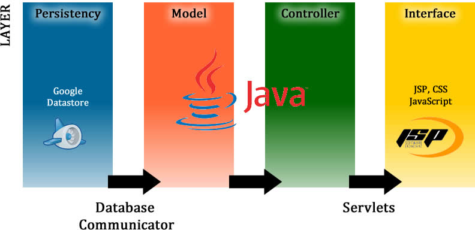

# [Aurora](http://aurora--cwb1.appspot.com)

Course Problem Solving and Design 3: [Aurora](http://aurora--cwb1.appspot.com)

**Team** [cwb1](http://ariadne.cs.kuleuven.be/mediawiki/index.php/CWB1-1112):
* [Matthias Moulin](https://github.com/matt77hias) (Computer Science)
* Nathan Moesen (Chemical Engineering)
* Pieter Marynissen
* Sebastiaan Maes (Economics)
* Sophie Marien (Computer Science)
* Tom Molderez (Electrical Engineering)

**Academic Year**: 2011-2012 (1st semester - 1st Bachelor of Science in Engineering: Computer Science)

## About
Web application that accurately tracks study efforts and results in the context of quantified learning and learning analytics.

## Design

