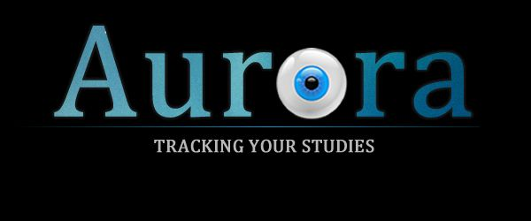

[![License][s1]][li]

[s1]: https://img.shields.io/badge/licence-GPL%203.0-blue.svg
[li]: https://raw.githubusercontent.com/matt77hias/Aurora/master/LICENSE.txt

# Aurora

Course Problem Solving and Design 3: Aurora

**Team** cwb1:
* [Matthias Moulin](https://github.com/matt77hias) (Computer Science)
* Nathan Moesen (Chemical Engineering)
* Pieter Marynissen (Chemical Engineering)
* Sebastiaan Maes (Economics)
* Sophie Marien (Computer Science)
* Tom Molderez (Electrical Engineering)

**Academic Year**: 2011-2012 (1st semester - 1st Bachelor of Science in Engineering: Computer Science)

## About
Web application that accurately tracks study efforts and results in the context of quantified learning and learning analytics.

## Design

